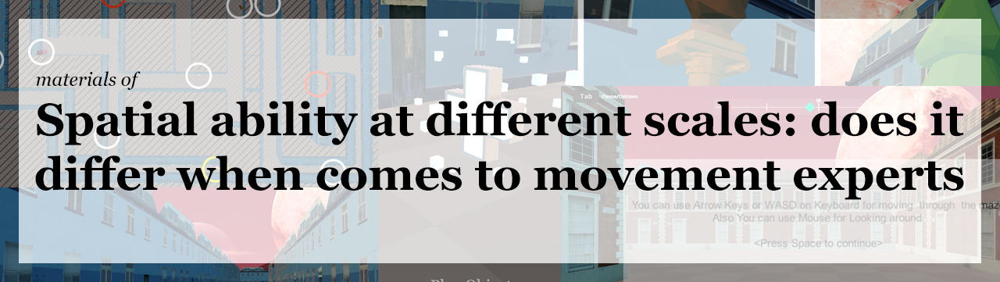

# Spatial ability, Movement experts, scales of space
This repo contains materials and source (including the Spatial ability, Movement experts, scales of space Unity Project assets for further development or future studies, and also the final game and experiment we used in our paper) 
we served these materials as an Open source Unity-based package for designing next-generation psychophysics tasks with the main goal of helping scientists with not that much skill in C# programming. 
